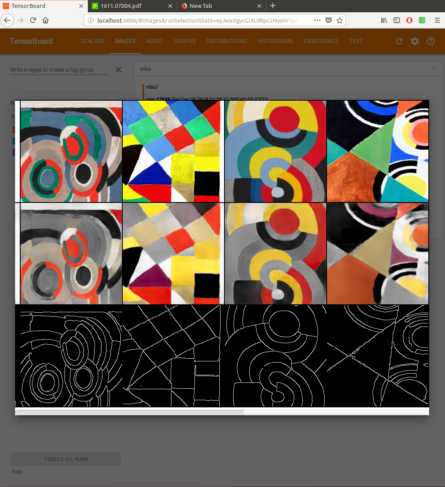
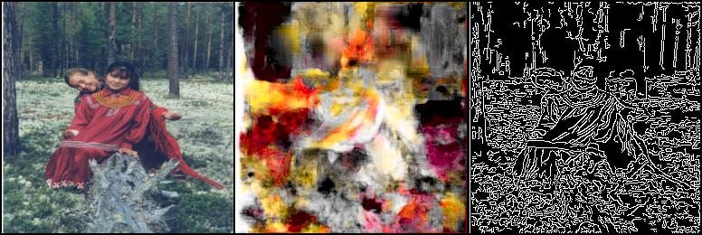
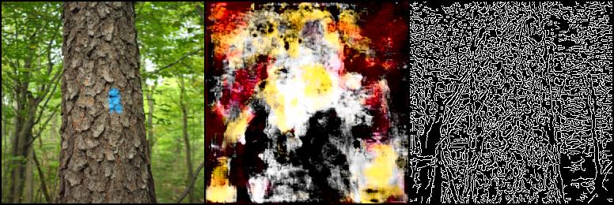

# Pytorch pix2pix implementation

## How to run ?
- cd in this directory
- Start a docker env for pytorch `sudo docker run --rm -it --init   --runtime=nvidia   --ipc=host   --user="$(id -u):$(id -g)"   --volume=$PWD:/app -v /your/db/folder:/data  -e NVIDIA_VISIBLE_DEVICES=0   anibali/pytorch /bin/bash`
- Install requirements via `pip install -r requirements.txt`
- You can run the training via `python3 run_training.py`

## Dataset modes
- Colorisation
- Edge2Something (see example, edge to Delaunay)

## Using tensorboard to visualize the training
Tensorboard is a great tool and is wonderful in this case to see where your training is going.
You can run `sudo docker run  -d -p 6006:6006 -v $(pwd)/logs:/logs --name my-tf-tensorboard volnet/tensorflow-tensorboard` in the directory of training and will get nice visualisation.
In this example, delaunay paintings texture are learned from the edges

## What can I get ?
Mostly bad modern art for the edge to Delaunay

